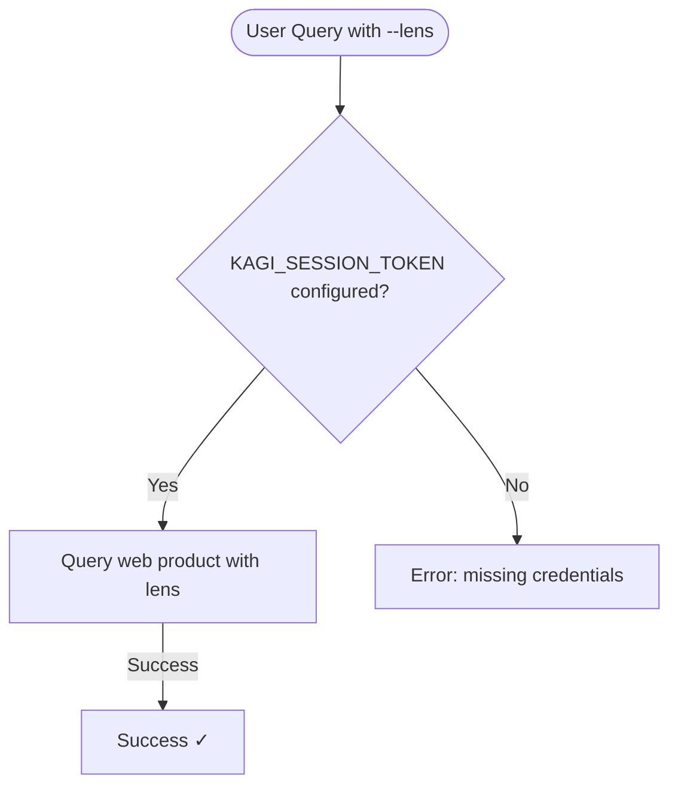
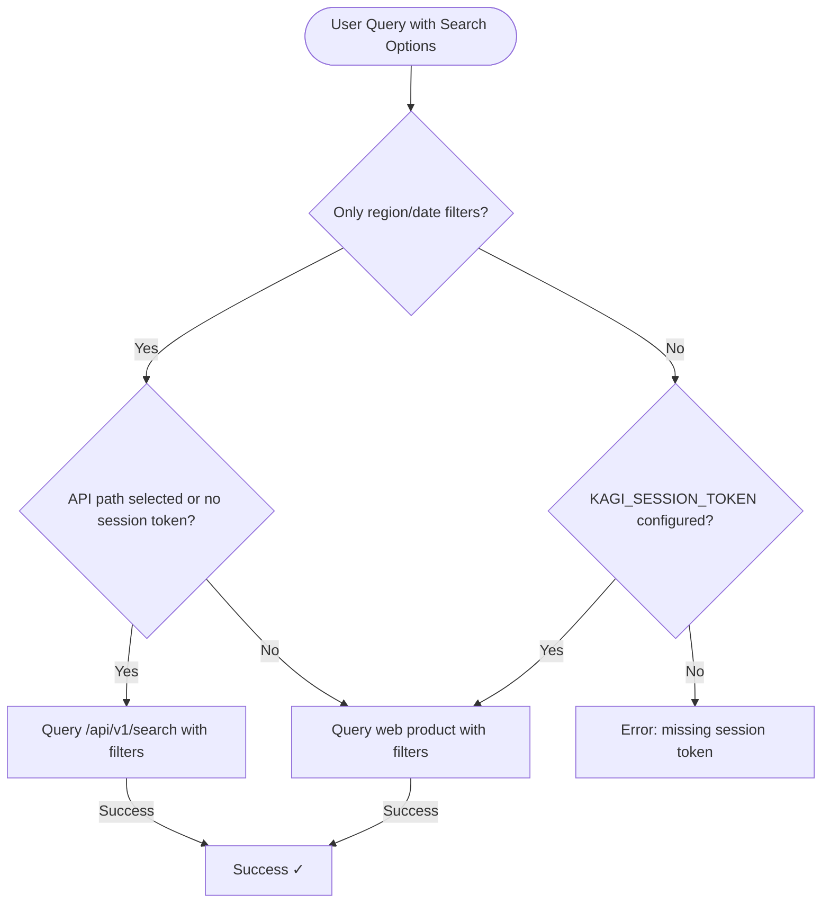

# Authentication Matrix

This reference provides a complete mapping of which commands require which authentication tokens, including fallback behavior and special cases.

## Command Overview

| Command | Preferred Auth | Fallback | Notes |
|---------|---------------|----------|-------|
| `search` (base) | Configured base-search preference | Session fallback only when API-first mode is enabled | Defaults to session unless `[auth.preferred_auth] = "api"` |
| `search --lens` | `KAGI_SESSION_TOKEN` | None | Lens requires session token |
| `search` with filters | `KAGI_SESSION_TOKEN` | None | Region, time, date, order, verbatim, and personalization filters require session token |
| `auth` | None | None | Interactive TTY wizard; writes config and validates the selected credential |
| `auth status` | None | None | Reads config only |
| `auth check` | Primary credential | None | Tests selected token |
| `auth set` | None | None | Saves credentials |
| `summarize` | `KAGI_API_TOKEN` | None | Legacy `/api/v0` public API |
| `summarize --subscriber` | `KAGI_SESSION_TOKEN` | None | Subscriber web product |
| `extract` | `KAGI_API_KEY` | None | Current `/api/v1` Extract API |
| `news` | None | None | Public endpoint |
| `quick` | `KAGI_SESSION_TOKEN` | None | Quick Answer web product |
| `ask-page` | `KAGI_SESSION_TOKEN` | None | Subscriber feature |
| `assistant` | `KAGI_SESSION_TOKEN` | None | Subscriber feature |
| `assistant custom` | `KAGI_SESSION_TOKEN` | None | Custom assistant settings |
| `lens` | `KAGI_SESSION_TOKEN` | None | Lens settings management |
| `bang custom` | `KAGI_SESSION_TOKEN` | None | Custom bang settings |
| `redirect` | `KAGI_SESSION_TOKEN` | None | Redirect rule settings |
| `translate` | `KAGI_SESSION_TOKEN` | None | Text mode only; bootstraps `translate_session` over HTTP |
| `fastgpt` | `KAGI_API_TOKEN` | None | Legacy `/api/v0` public API |
| `enrich web` | `KAGI_API_TOKEN` | None | Legacy `/api/v0` public API |
| `enrich news` | `KAGI_API_TOKEN` | None | Legacy `/api/v0` public API |
| `smallweb` | None | None | Public feed |

## Detailed Breakdown

### Search Commands

#### Base Search (`kagi search`)

```mermaid
flowchart TD
    Start([User Query]) --> Pref{[auth.preferred_auth] = api?}

    Pref -->|No or unset| CheckSession{KAGI_SESSION_TOKEN configured?}
    CheckSession -->|Yes| TryWeb[Try web product]
    TryWeb -->|Success| ReturnResults1[Return results ✓]
    CheckSession -->|No| CheckAPI1{KAGI_API_KEY configured?}
    CheckAPI1 -->|Yes| TryAPI1[Try Search API]
    TryAPI1 -->|Success| ReturnResults2[Return results ✓]
    CheckAPI1 -->|No| Error1[Error: missing credentials]

    Pref -->|Yes| CheckAPI2{KAGI_API_KEY configured?}
    CheckAPI2 -->|Yes| TryAPI2[Try Search API]
    TryAPI2 -->|Success| ReturnResults3[Return results ✓]
    TryAPI2 -->|Auth error| CheckSession2{KAGI_SESSION_TOKEN configured?}
    CheckSession2 -->|Yes| TryWebFallback[Try web product]
    TryWebFallback -->|Success| ReturnResults4[Success ✓]
    CheckSession2 -->|No| Error2[Error: auth failed]
    CheckAPI2 -->|No| CheckSession3{KAGI_SESSION_TOKEN configured?}
    CheckSession3 -->|Yes| TryWeb2[Try web product]
    TryWeb2 -->|Success| ReturnResults5[Return results ✓]
    CheckSession3 -->|No| Error3[Error: missing credentials]
```

**Key insight:** Base search is the only command with fallback behavior, and that fallback only matters when you explicitly opt into API-first mode.

#### Lens Search (`kagi search --lens <INDEX>`)



**No fallback:** Lens search requires session token exclusively.

#### Search Filters and Session-Only Options



`--region`, `--from-date`, and `--to-date` map to the current V1 Search API `filters` object. `--lens`, `--time`, `--order`, `--verbatim`, and personalization flags remain session-only because they target the subscriber web-product flow exposed by this CLI.

### Authentication Commands

#### `kagi auth`

- **Purpose:** Interactive setup wizard
- **Network:** Yes, during credential validation
- **Uses:** The credential the user just pasted
- **Writes:** `~/.config/kagi-cli/config.toml`
- **TTY only:** In non-interactive environments, use `auth set`, `status`, or `check`

#### `kagi auth status`

- **Purpose:** Display current configuration
- **Network:** No
- **Reads:** Environment variables, config file
- **Output:** Shows which tokens are configured and their sources

#### `kagi auth check`

- **Purpose:** Validate credentials work
- **Network:** Yes (test search)
- **Uses:** Primary credential per `[auth.preferred_auth]` setting (defaults to session token)
- **No fallback:** Tests primary credential only

#### `kagi auth set`

- **Purpose:** Save credentials to file
- **Network:** No
- **Writes:** `~/.config/kagi-cli/config.toml`
- **Creates:** Config file if doesn't exist

### Content Commands

#### Summarization

| Mode | Token | Notes |
|------|-------|-------|
| Public API (default) | `KAGI_API_TOKEN` | Uses legacy Universal Summarizer API |
| Subscriber (`--subscriber`) | `KAGI_SESSION_TOKEN` | Uses web product summarizer |

**Important:** These are mutually exclusive. You cannot use `--subscriber` with API-only options like `--engine`.

#### AI Commands

| Command | Token | Purpose |
|---------|-------|---------|
| `quick` | `KAGI_SESSION_TOKEN` | Quick answers with references |
| `ask-page` | `KAGI_SESSION_TOKEN` | Ask Assistant about one page URL |
| `assistant` | `KAGI_SESSION_TOKEN` | Conversational AI with threads |
| `assistant custom` | `KAGI_SESSION_TOKEN` | Create and manage saved assistants |
| `translate` | `KAGI_SESSION_TOKEN` | Kagi Translate text mode |
| `fastgpt` | `KAGI_API_TOKEN` | Quick factual answers through legacy `/api/v0` |
| `extract` | `KAGI_API_KEY` | Full-page markdown extraction through current `/api/v1` |

#### Settings Commands

| Command | Token | Purpose |
|---------|-------|---------|
| `lens` | `KAGI_SESSION_TOKEN` | Manage search lenses |
| `bang custom` | `KAGI_SESSION_TOKEN` | Manage custom bangs |
| `redirect` | `KAGI_SESSION_TOKEN` | Manage redirect rules |

### Data Commands

#### Enrichment

Both `enrich web` and `enrich news` require legacy `KAGI_API_TOKEN`:

- **Teclis** (web) - Enhanced web search
- **TinyGem** (news) - Enhanced news search

### Feed Commands

#### Public Feeds (No Auth Required)

| Command | Endpoint | Update Frequency |
|---------|----------|------------------|
| `news` | Kagi News | Continuous |
| `smallweb` | Small Web | Periodic |

## Token Requirements by Feature

### Session Token Features

Requires `KAGI_SESSION_TOKEN`:

- ✅ Lens-aware search (`--lens`)
- ✅ Quick Answer (`quick`)
- ✅ Session-only search options (`--lens`, `--time`, `--order`, `--verbatim`, personalization flags)
- ✅ Kagi Assistant prompt and thread commands (`assistant`)
- ✅ Custom assistant management (`assistant custom`)
- ✅ Ask Page (`ask-page`)
- ✅ Lens management (`lens`)
- ✅ Custom bang management (`bang custom`)
- ✅ Redirect management (`redirect`)
- ✅ Kagi Translate (`translate`)
- ✅ Subscriber Summarizer (`summarize --subscriber`)
- ✅ Base search (fallback)

### API Key Features

Requires `KAGI_API_KEY`:

- ✅ Current Search API (`search` when `[auth.preferred_auth] = "api"`)
- ✅ Extract API (`extract`)

### Legacy API Token Features

Requires `KAGI_API_TOKEN`:

- ✅ FastGPT (`fastgpt`)
- ✅ Public Summarizer (`summarize`)
- ✅ Web Enrichment (`enrich web`)
- ✅ News Enrichment (`enrich news`)

### No Token Required

Works without authentication:

- ✅ Kagi News (`news`)
- ✅ Small Web (`smallweb`)
- ✅ Auth status (`auth status`)

## Configuration Precedence

### Resolution Order

```
1. Environment Variables (KAGI_API_KEY, KAGI_API_TOKEN, KAGI_SESSION_TOKEN)
   ↓ (if not set)
2. Configuration File (`~/.config/kagi-cli/config.toml`)
   ↓ (if not set)
3. Missing (error for commands requiring auth)
```

The config file is resolved from `$KAGI_CONFIG` (an explicit full path), then `$XDG_CONFIG_HOME/kagi-cli/config.toml`, then `~/.config/kagi-cli/config.toml`. Environment variables override the config file.

### Example Scenarios

**Scenario 1: Multiple credentials in file**
```toml
# ~/.config/kagi-cli/config.toml
[auth]
api_token = "api123"
api_key = "key123"
session_token = "session456"
```
- `search`: Uses the configured base-search preference (session by default)
- `assistant`: Uses session token
- `assistant custom`: Uses session token
- `lens`: Uses session token
- `news`: No token needed

**Scenario 2: Mixed sources**
```bash
export KAGI_API_KEY="key789"
# ~/.config/kagi-cli/config.toml has session_token only
```
- `search`: Uses env API key when `[auth.preferred_auth] = "api"`
- `summarize --subscriber`: Uses file session token
- `fastgpt`: Requires `KAGI_API_TOKEN` or `[auth].api_token`

**Scenario 3: Environment overrides file**
```bash
export KAGI_SESSION_TOKEN="special_session"
# ~/.config/kagi-cli/config.toml has different session_token
```
- `search`: Uses env session token (not API, so tries web)
- `assistant`: Uses env session token
- `redirect`: Uses env session token

## Common Configurations

### Session Token Only

**Setup:**
```bash
kagi auth set --session-token 'https://kagi.com/search?token=...'
```

**Working commands:**
- ✅ `kagi search "query"` (uses session path)
- ✅ `kagi search --lens 2 "query"`
- ✅ `kagi quick "what is rust"`
- ✅ `kagi search --region us --time month "query"`
- ✅ `kagi ask-page https://example.com "question"`
- ✅ `kagi assistant "prompt"`
- ✅ `kagi assistant custom list`
- ✅ `kagi lens list`
- ✅ `kagi bang custom list`
- ✅ `kagi redirect list`
- ✅ `kagi translate "Bonjour tout le monde"`
- ✅ `kagi summarize --subscriber --url ...`
- ✅ `kagi news`
- ✅ `kagi smallweb`

**Non-working:**
- ❌ `kagi fastgpt` - requires API token
- ❌ `kagi summarize --url ...` (without --subscriber) - requires API token
- ❌ `kagi enrich web` - requires API token
- ❌ `kagi extract` - requires API key

### Legacy API Token Only

**Setup:**
```bash
kagi auth set --api-token 'your_api_token'
```

**Working commands:**
- ✅ `kagi summarize --url ...`
- ✅ `kagi fastgpt "query"`
- ✅ `kagi enrich web "query"`
- ✅ `kagi news`
- ✅ `kagi smallweb`

**Non-working:**
- ❌ `kagi search "query"` with `[auth.preferred_auth] = "api"` - requires API key or session token
- ❌ `kagi search --lens 2` - requires session token
- ❌ `kagi quick` - requires session token
- ❌ `kagi search --region us "query"` - requires session token
- ❌ `kagi ask-page https://example.com "question"` - requires session token
- ❌ `kagi quick` - requires session token
- ❌ `kagi assistant` - requires session token
- ❌ `kagi assistant custom list` - requires session token
- ❌ `kagi lens list` - requires session token
- ❌ `kagi bang custom list` - requires session token
- ❌ `kagi redirect list` - requires session token
- ❌ `kagi summarize --subscriber` - requires session token
- ❌ `kagi extract` - requires API key

### Session Token, API Key, and Legacy API Token

**Setup:**
```bash
kagi auth set --session-token '...' --api-key '...' --api-token '...'
```

**All commands work:**
- ✅ Everything listed above

**Smart behavior:**
- `search`: Uses session (default), or API key if `[auth.preferred_auth = "api"]` is set
- `extract`: Uses API key directly
- `summarize` without `--subscriber`: Uses legacy API token
- `summarize --subscriber`: Uses session
- `quick`: Uses session
- `ask-page`: Uses session
- `assistant`: Uses session
- `assistant custom`: Uses session
- `lens`: Uses session
- `bang custom`: Uses session
- `redirect`: Uses session
- `fastgpt`: Uses legacy API token

## Troubleshooting Matrix

| Symptom | Check | Solution |
|---------|-------|----------|
| "missing credentials" | `kagi auth status` | Set appropriate token |
| "requires KAGI_SESSION_TOKEN" | Token type | Use `--subscriber` or set session token |
| "requires KAGI_API_KEY" | Token type | Set API key for current Search API or Extract |
| "requires KAGI_API_TOKEN" | Token type | Remove `--subscriber` or set legacy API token |
| "auth check failed" | Token validity | Regenerate token in Kagi settings |
| `search --lens` fails | Session token | Verify session token configured |
| `fastgpt` fails | Legacy API token + credit | Check API credit balance |

## Security Considerations

### Token Storage

- **Environment variables:** Process-wide, may leak to subprocesses
- **Config file:** Stored on disk, should be 600 permissions
- **Shell history:** May contain `export` commands

**Recommendation:** Use config file for persistence, environment variables for overrides.

### Scope of Access

- **Session Token:** Full subscriber access (search, assistant, summarizer)
- **API Key:** Current `/api/v1` API-only access (search, extract)
- **Legacy API Token:** Older `/api/v0` API-only access (fastgpt, enrich, public summarizer)

**Principle:** Use least-privilege tokens for specific workflows.

## Migration Scenarios

### Adding API to existing Session setup

```bash
# Already have session token
kagi auth set --api-token 'new_api_token'

# Now fastgpt works
kagi fastgpt "question"
```

### Adding Session to existing API setup

```bash
# Already have API token
kagi auth set --session-token 'https://kagi.com/search?token=...'

# Now assistant works
kagi assistant "prompt"
```

## Reference Tables

### Quick Reference

| Want to... | Token Needed | Command |
|------------|--------------|---------|
| Search generally | Either | `kagi search` |
| Use my lens | Session | `kagi search --lens` |
| Manage my lenses | Session | `kagi lens` |
| Quick answer from the web product | Session | `kagi quick` |
| Faster factual answer from the API | API | `kagi fastgpt` |
| AI conversation | Session | `kagi assistant` |
| Manage saved assistants | Session | `kagi assistant custom` |
| Manage custom bangs | Session | `kagi bang custom` |
| Manage redirect rules | Session | `kagi redirect` |
| Translate text | Session | `kagi translate` |
| Summarize (free API) | API | `kagi summarize --url` |
| Summarize (subscription) | Session | `kagi summarize --subscriber` |
| Read news | None | `kagi news` |
| Explore small web | None | `kagi smallweb` |

### Error to Action Mapping

| Error | Meaning | Action |
|-------|---------|--------|
| `requires KAGI_API_TOKEN` | Need API access | Set API token or check command flags |
| `requires KAGI_SESSION_TOKEN` | Need subscriber access | Set session token |
| `missing credentials` | No token configured | Set appropriate token |
| `auth check failed` | Token invalid | Regenerate token |
